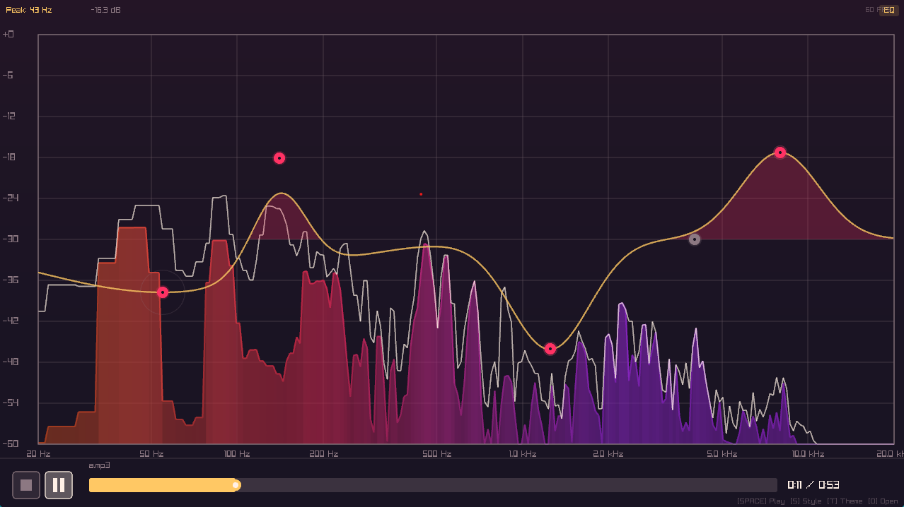

# Audio Spectrum Visualizer

A real-time audio spectrum visualizer built in C++ using FFT (Fast Fourier Transform) algorithm. Displays frequency content from 20Hz to 20,000Hz with multiple visualization styles and color themes.



## Features

- **Real-time FFT Analysis**: Cooley-Tukey radix-2 FFT algorithm for efficient frequency analysis
- **Wide Frequency Range**: 20Hz - 20kHz (full human hearing range)
- **Multiple Visualization Styles**:
  - Bars (classic spectrum analyzer)
  - Waves (smooth waveform display)
  - Circles (radial spectrum)
  - Particles (particle-based reactive visualization)
  - Mirror (symmetric horizontal display)
- **Color Themes**: Cyberpunk, Neon, Sunset, Ocean, Monochrome
- **Audio Format Support**: MP3, WAV, FLAC, OGG, M4A, AAC
- **Interactive Controls**: Play/pause, seek, volume, style switching
- **Drag & Drop**: Simply drop audio files onto the window
- **Peak Indicators**: Visual peak hold with decay
- **Frequency Grid**: Reference grid with frequency labels

## Dependencies

- **CMake** 3.16 or higher
- **C++17** compatible compiler
- **raylib** (automatically downloaded via FetchContent)
- **miniaudio** (automatically downloaded during build)

## Building

### Windows (Visual Studio)

```bash
# Clone the repository
git clone <repository-url>
cd fft

# Create build directory
mkdir build
cd build

# Generate Visual Studio project
cmake .. -G "Visual Studio 17 2022"

# Build
cmake --build . --config Release

# Run
./Release/AudioSpectrumVisualizer.exe path/to/audio.mp3
```

### Windows (MinGW)

```bash
mkdir build
cd build
cmake .. -G "MinGW Makefiles" -DCMAKE_BUILD_TYPE=Release
cmake --build .
./AudioSpectrumVisualizer.exe path/to/audio.mp3
```

### Linux

```bash
# Install dependencies (Ubuntu/Debian)
sudo apt install build-essential cmake git libgl1-mesa-dev libx11-dev libxrandr-dev libxi-dev

mkdir build
cd build
cmake .. -DCMAKE_BUILD_TYPE=Release
cmake --build . -j$(nproc)
./AudioSpectrumVisualizer path/to/audio.mp3
```

### macOS

```bash
# Install Xcode command line tools
xcode-select --install

mkdir build
cd build
cmake .. -DCMAKE_BUILD_TYPE=Release
cmake --build . -j$(sysctl -n hw.ncpu)
./AudioSpectrumVisualizer path/to/audio.mp3
```

## Usage

```bash
# Run with an audio file
./AudioSpectrumVisualizer music.mp3

# Or run without arguments and use the file dialog
./AudioSpectrumVisualizer
```

## Controls

| Key | Action |
|-----|--------|
| `SPACE` | Play / Pause |
| `←` / `→` | Seek backward / forward (5 seconds) |
| `T` | Cycle color themes |
| `S` | Cycle visualization styles |
| `G` | Toggle frequency grid |
| `P` | Toggle peak indicators |
| `M` | Toggle vertical mirror mode |
| `I` | Toggle info display |
| `O` | Open file dialog |
| `ESC` | Exit |

**Mouse**: Click on the progress bar to seek to a position.

**Drag & Drop**: Drop audio files directly onto the window to load them.

## Project Structure

```
fft/
├── CMakeLists.txt          # Build configuration
├── README.md               # This file
├── external/               # External dependencies
│   └── miniaudio.h         # (downloaded automatically)
└── src/
    ├── main.cpp            # Application entry point
    ├── fft.hpp             # FFT algorithm header
    ├── fft.cpp             # FFT implementation
    ├── audio_analyzer.hpp  # Audio loading/analysis header
    ├── audio_analyzer.cpp  # Audio loading/analysis implementation
    ├── spectrum_visualizer.hpp  # Visualization header
    └── spectrum_visualizer.cpp  # Visualization implementation
```

## Technical Details

### FFT Implementation

The project uses a custom implementation of the Cooley-Tukey FFT algorithm:
- Radix-2 decimation-in-time (DIT) approach
- In-place computation with bit-reversal permutation
- Supports window functions: Hann, Hamming, Blackman
- Configurable FFT size (default: 4096 samples)

### Audio Processing

- **Sample Rate**: Adapts to source file (typically 44.1kHz or 48kHz)
- **FFT Window**: 4096 samples (~93ms at 44.1kHz)
- **Frequency Resolution**: ~10.8 Hz per bin at 44.1kHz
- **Frequency Bands**: 128 logarithmically-spaced bands
- **Smoothing**: Temporal smoothing with configurable decay

### Visualization

- **Frame Rate**: 60 FPS target
- **Rendering**: raylib with hardware acceleration
- **Anti-aliasing**: 4x MSAA
- **Dynamic Range**: Logarithmic magnitude scaling

## Configuration

The analyzer and visualizer can be configured programmatically:

```cpp
// Analyzer configuration
audio::AnalyzerConfig analyzerConfig;
analyzerConfig.fftSize = 4096;           // FFT window size
analyzerConfig.numBands = 128;           // Number of frequency bands
analyzerConfig.minFrequency = 20.0;      // Min frequency (Hz)
analyzerConfig.maxFrequency = 20000.0;   // Max frequency (Hz)
analyzerConfig.smoothingFactor = 0.75;   // Temporal smoothing
analyzerConfig.useLogScale = true;       // Logarithmic frequency scale

// Visualizer configuration
viz::VisualizerConfig vizConfig;
vizConfig.windowWidth = 1280;
vizConfig.windowHeight = 720;
vizConfig.sensitivity = 2.0f;            // Visual sensitivity
vizConfig.showPeaks = true;              // Show peak indicators
vizConfig.showGrid = true;               // Show frequency grid
```

## License

This project is open source. Feel free to use, modify, and distribute.

## Acknowledgments

- [raylib](https://www.raylib.com/) - Simple and easy-to-use graphics library
- [miniaudio](https://miniaud.io/) - Single-header audio playback and capture library


